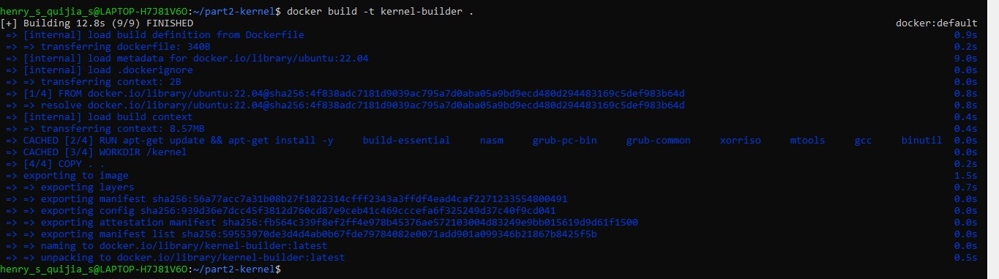
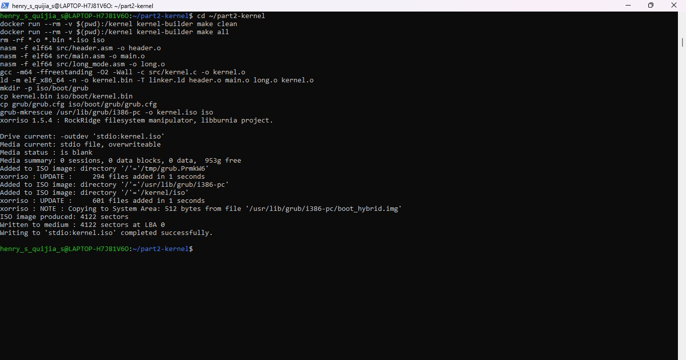
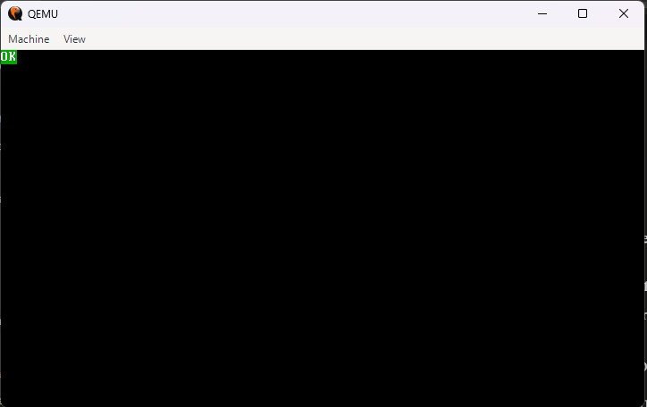
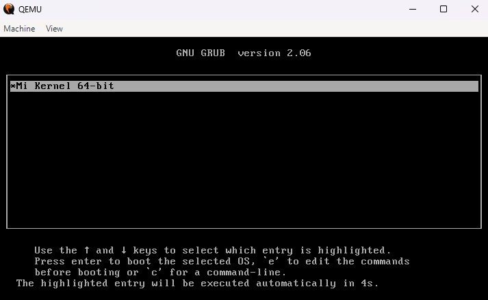
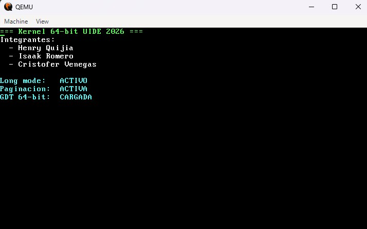

Aquí está el README completo listo para pegar en GitHub:
# Parte 2 — Kernel de 64 bits

## Integrantes
- Henry Quijia
- Isaak Romero
- Cristofer Venegas

## Descripción
Kernel de 64 bits construido desde cero usando NASM, GCC cross-compiler y GRUB.
Arranca en QEMU mediante un ISO generado con grub-mkrescue.

## Estructura del proyecto
parte2/
├── Dockerfile           <- entorno de compilación reproducible
├── Makefile             <- targets: all, clean
├── linker.ld            <- script del linker
├── grub/
│   └── grub.cfg         <- configuración de GRUB
├── screenshots/         <- capturas de evidencia
└── src/
    ├── header.asm       <- Multiboot2 header (Episodio 1)
    ├── main.asm         <- verificaciones + paginación + GDT (Episodio 2)
    ├── long_mode.asm    <- salto a 64 bits (Episodio 2)
    └── kernel.c         <- función print_str en C (Episodio 2)

## Requisitos
- Docker
- QEMU (qemu-system-x86_64)

## Instrucción de build en una línea
docker build -t kernel-builder . && docker run --rm -v $(pwd):/kernel kernel-builder make all

## Pasos completos

### 1. Construir la imagen Docker
docker build -t kernel-builder .

### 2. Compilar el kernel
docker run --rm -v $(pwd):/kernel kernel-builder make all

### 3. Ejecutar en QEMU
qemu-system-x86_64 -cdrom kernel.iso -boot d -m 512M

## Episodio 1 — Multiboot2 + OK en QEMU
- Se crea el header Multiboot2 en header.asm con el magic number 0xe85250d6
- El kernel arranca en modo protegido de 32 bits
- Escribe directamente en la memoria VGA 0xB8000 para imprimir OK
- GRUB reconoce el kernel y lo carga correctamente

## Episodio 2 — Kernel 64 bits completo
- Verifica magic number de Multiboot2 en registro EAX
- Verifica soporte de CPUID en la CPU
- Verifica soporte de long mode de 64 bits
- Configura tablas de paginación identity-map primer GB con huge pages de 2MB
- Construye GDT de 64 bits
- Salta a long mode con far jump
- Llama a kernel_main en C que imprime mensaje personalizado del grupo

## Capturas

### Docker build — entorno reproducible

### Compilacion exitosa

### Episodio 1 — OK en QEMU

### Menu de GRUB

### Episodio 2 — Kernel 64 bits con nombres del grupo

